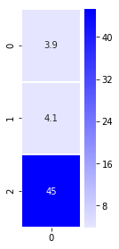

# RNN Attention Scores Implementation  

This notebook implements Attention scoring algorithm and calculating attention context vector 

Below is sample attention context vector represented in heatmap:

There are 2 main parts of this model:

1. **Scoring**: Scoring implementation 

2. **Context Vector**: Calculate Context vector and visualize it in heatmap 

